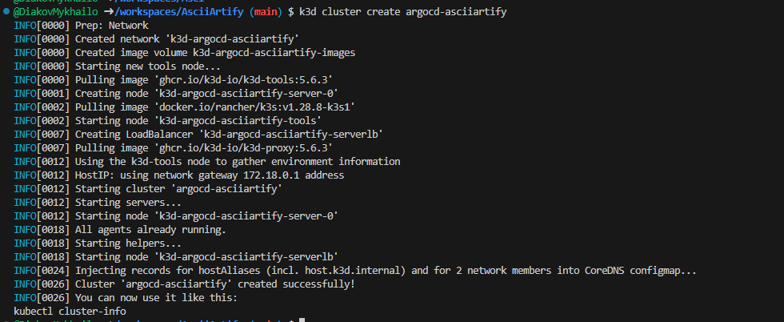
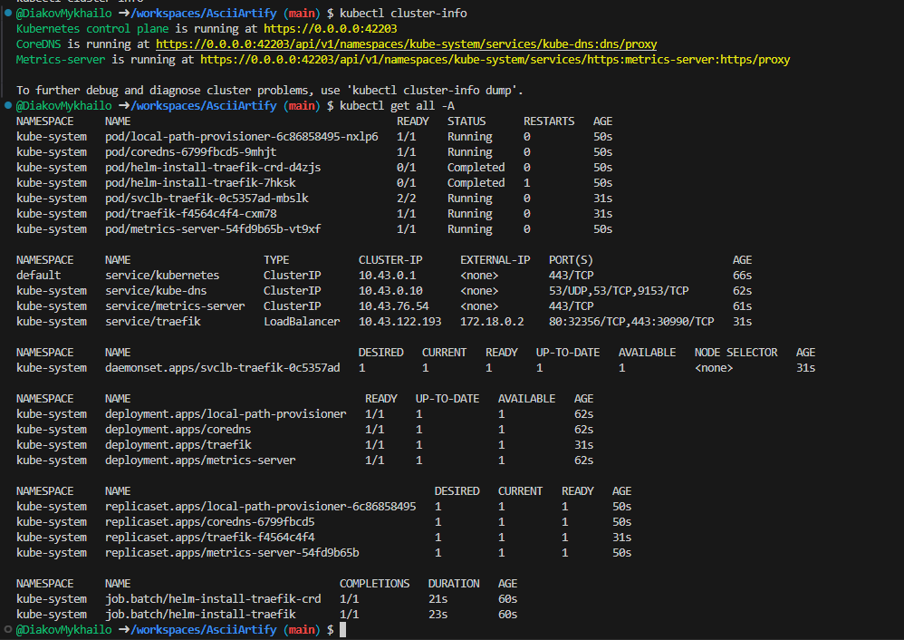
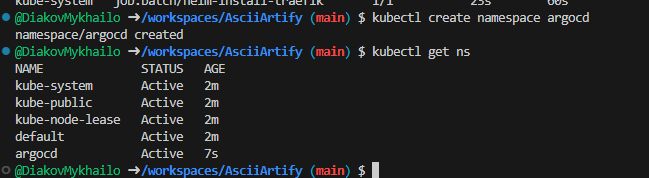
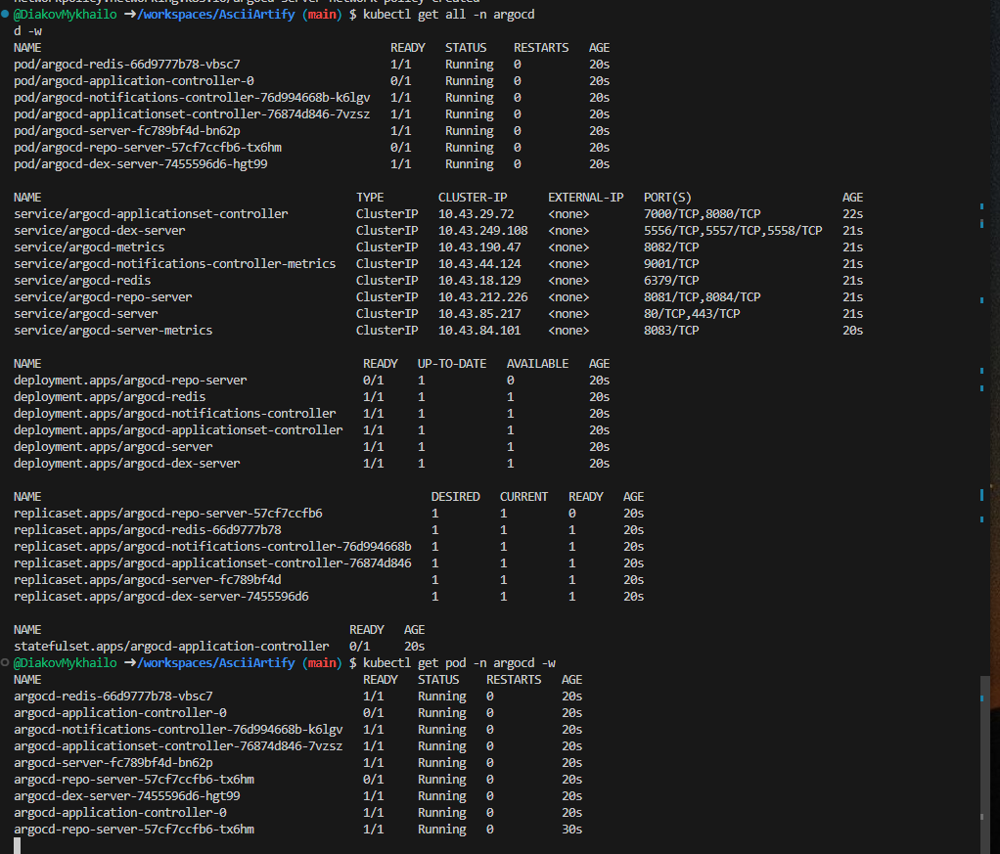
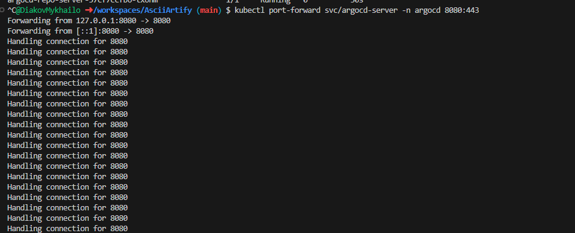
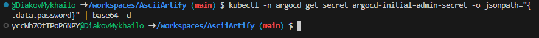
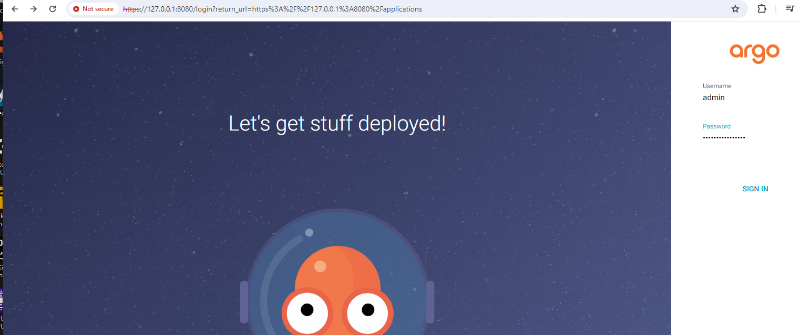
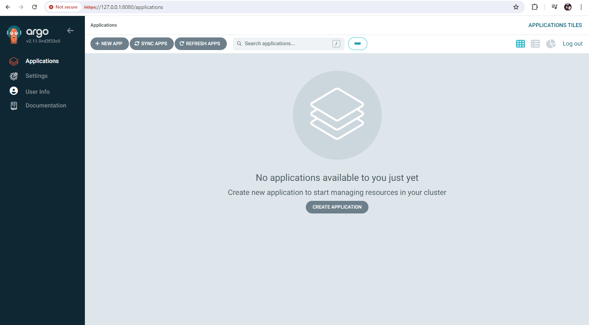

# Accessing the ArgoCD Interface

## Step-by-Step Guide to Installation and Accessing the ArgoCD Interface

### Step 1: Creating a Kubernetes Cluster Using k3d
1. Open the terminal or command prompt.
2. Enter the command to create a local Kubernetes cluster using k3d:
   ```bash
   k3d cluster create argocd-asciiartify
   ```
3. Check the cluster's status:
   ```bash
   kubectl cluster-info
   kubectl get all -A
   ```




### Step 2: Installing ArgoCD
4. Create the argocd namespace in the cluster:
  ```bash
  kubectl create namespace argocd
  kubectl get ns
  ```
5. Install ArgoCD using kubectl into the created namespace:
  ```bash
  kubectl apply -n argocd -f https://raw.githubusercontent.com/argoproj/argo-cd/stable/manifests/install.yaml
  ```
  Check the cluster's status and pods in the argocd namespace:
  ```bash
  kubectl get all -n argocd
  kubectl get pod -n argocd -w
  ```

![kubectl apply -n argocd -f https://raw.githubusercontent.com/argoproj/argo-cd/stable/manifests/install.yaml]


### Step 3: Accessing the ArgoCD Web Interface
7. Use Port Forwarding to access the web interface. ArgoCD uses HTTPS, so port 443 is used:
  ```bash
  kubectl port-forward svc/argocd-server -n argocd 8080:443
   ```
  where argocd-server is the service in the argocd namespace.


6. Obtain the login password for the ArgoCD web interface (in a separate terminal tab):
  ```bash
  kubectl -n argocd get secret argocd-initial-admin-secret -o jsonpath="{.data.password}" | base64 -d
  ```


### Step 4: Opening the Web Interface
7. Open a web browser and go to the following link: http://localhost:8080/. In a local environment, indicate to the browser that you trust the resource because you will initially encounter a certificate error (certificates need to be installed separately in production).
8. Enter the username (default is admin) and the password obtained in step 6.


### Step 5: Using ArgoCD
9. You are now logged into the ArgoCD web interface. You can start exploring, adding, and managing your Kubernetes applications.
